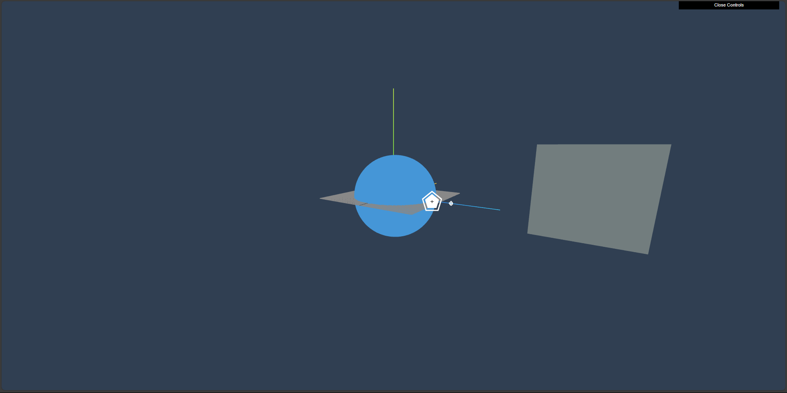

# 2D-CSS-And-WebGl-ThreeJS

<h2>Features</h2>
<ol>
  <li> In this project, a scene was created using WebGlRenderer and Css2DRenderer.</li>
  <li>Interactivity is created by adding a button on the Css2DRenderer side. This button is hidden when another object comes between it and the camera.</li>
</ol>

<h2>Startup</h2>
<ol>
  <li>npm i</li>
  <li>npm run dev</li>
</ol>

<h2>Screenshots</h2>

